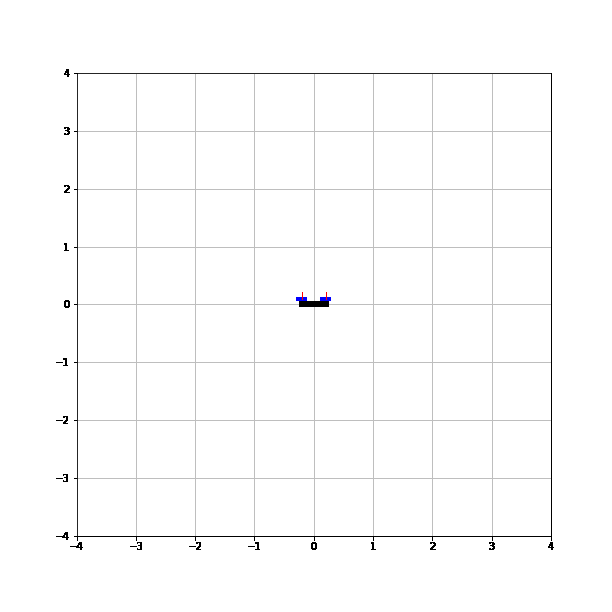
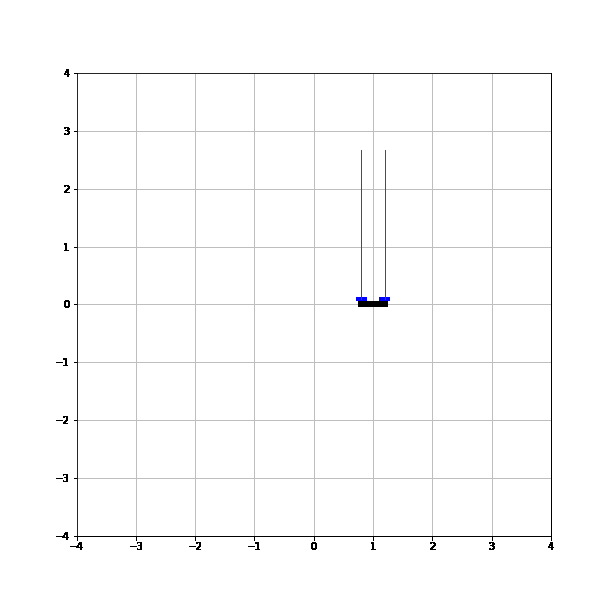
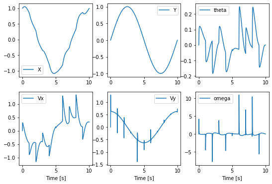
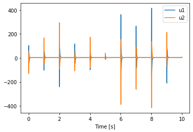
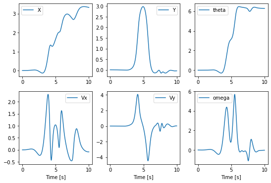
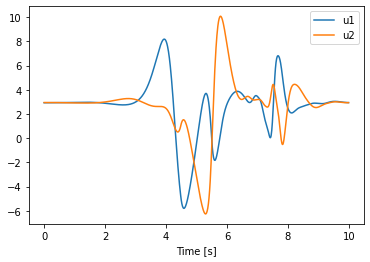

# Multirotor-Drone-Controller
In recent times, drones, especially quadrotors, are being used for important tasks such as surveillance(monitoring), delivery, search and rescue, to name a few. The underlying tasks often pose a complex motion planning and control problem. In this project, a LQR controller is designed for a drone to follow a predefined trajectory and an iLQR controller is designed for the drone to reach a goal position at a fixed time.

<!-- <p align = 'center'>


</p>   -->

|
 :--:|:--:
  *Resting at Stable points* |*Following Circular Trajectory using LQR Controller*

|
 :--:|:--:
 *90* $\degree$ *Flip* |*180* $\degree$ *Flip*

## LQR Controller 
The LQR controller uses a mathematical model of the system to optimize the control inputs to minimize a cost function of the system's performance, it calculates the control inputs that will minimize the difference between the desired and actual performance of the system. It also ensures the stability of the system by minimizing the control inputs.

The mathematical model of the system is linearized around the state and control to use the LQR controller. 
```python
get_linearization(state,control)
```
Quadratic cost is computed using the current state and control. Controller will try to minimize this cost.
```python
computeCost(z,u,horizonLength)
```
Riccati's equations are used the calculate the controls for the drone to follow the trajectory.
```python
trajectoryController(state,i)
```
### Plots of States and controls of drone following circular trajectory 
|
 :--:|:--:
  *State of Drone* |*Controls*
  
  ## iLQR Controller 
iLQR controller uses an iterative optimization algorithm to find the optimal control inputs for a system. It updates the control inputs based on the system's response to the current inputs, and iterates until the desired performance is achieved.

The mathematical model of the system is linearized around the state and control to use the LQR controller. 
```python
get_linearization(state,control)
```
Quadratic cost is computed using the current state and control. In iLQR controller cost function plays a major role. Using cost function trajectory of the drone can be controlled. 
```python
computeCost(z,u,horizonLength)
```
Riccati's equations and line search are used the calculate the controls for the drone to reach desired locations.
```python
ilrq1()
```
### Plots of States and controls of drone following circular trajectory 
|
 :--:|:--:
  *State of Drone* |*Controls*

